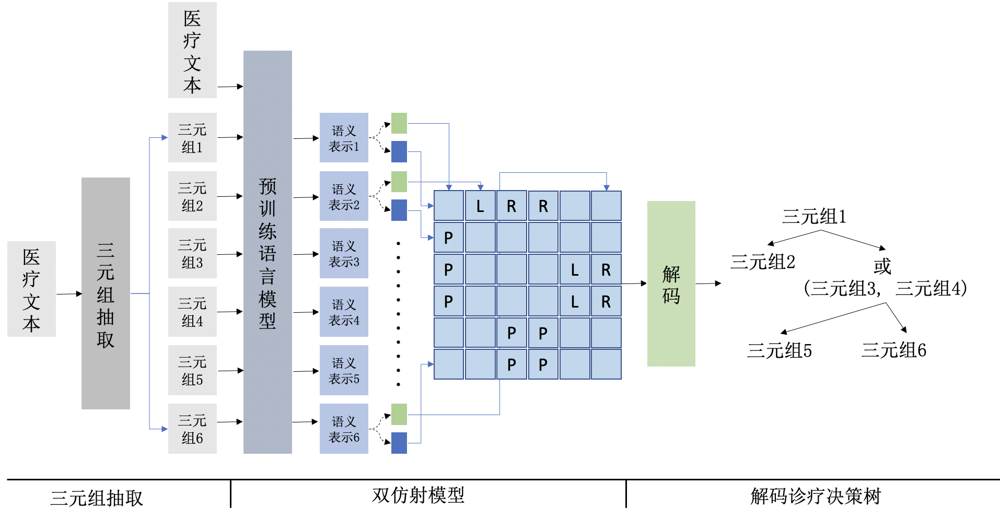
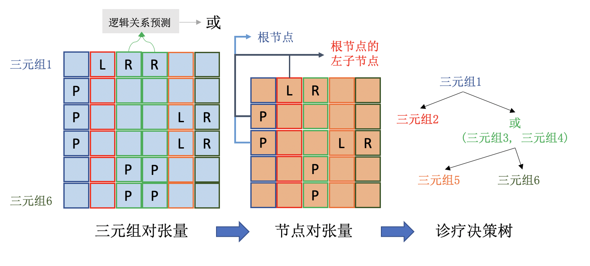

## Text2DT_Baseline

### 方法描述



<p align="center"> 图1 模型整体框架 </p>

#### 1. 三元组抽取

使用NLP社区中先进的抽取算法进行三元组的抽取，代码不在这里给出

#### 2. 双仿射模型

核心思想是：将树生成问题转化为填表问题，表中任意一个单元格的label表示对于两个三元组之间的关系，当模型填表完成后，通过解码算法将树从表中解码出来，具体如下：

在抽取出文本中的三元组后，使用一个双仿射模型来预测任意两个三元组在诊疗决策树中的关系。两个三元组在决策树中的关系包含四种： $(t_i,P,t_j)$ 表示三元组 $t_i$ 所在的节点是三元组 $t_j$ 所在节点的父节点； $(t_i,L,t_j)$ 表示三元组 $t_i$ 所在的节点是三元组 $t_j$ 所在节点的左子节点； $(t_i,R,t_j)$ 表示三元组 $t_i$ 所在的节点是三元组 $t_j$ 所在节点的右子节点； $(t_i,N,t_j)$ 表示三元组 $t_i$ 所在节点与三元组 $t_j$ 所在节点没有相邻父子关系，见图1。我们将上一步抽取出的三元组按照尾实体在文本中出现的顺序拼接在医疗文本之后，并使用标记符  $[S]$ 和 $[E]$  进行三元组的分隔。使用预训练语言模型对拼接后的文本 $\hat{X}$ 进行编码并将标记符 $[S_i]$ 编码后得到的隐向量作为三元组 $t_i$ 的语义表示。为了编码两个三元组之间的信息交互，我们对任意两个三元组的语义表示使用双仿射注意力在标签空间上输出概率张量 $\mathcal{P} \in \mathbb{R}^{|n_{tri}| \times|n_{tri}| \times|\mathcal{Y}|}$ ，并使用softmax函数来输出每个三元组对的标签。双仿射模型的损失函数为交叉熵损失函数。

#### 3. 将三元组对表解码为诊疗决策树



<p align="center"> 图2 解码框架 </p>

解码分为三个步骤：1节点解码、逻辑关系预测与树结构解码，见图2。

 __节点解码__：节点解码的关键在于，处于同一节点的三元组，它们和其他任一三元组的在诊疗决策树中关系都是相同的，因此它们在概率张量 $\mathcal{P}$ 中对应的行或列应该是相似的，反之则亦然。本文将计算张量中 $\mathcal{P}$ 两列（两行）的余弦相似度，相似度大于阈值的两行（两列)对应的三元组属于同一节点。

 __逻辑关系预测__：如果多个三元组属于同一节点，需要预测多个三元组之间的逻辑关系。

 __树结构解码__：本文首先将三元组对的概率张量 $\mathcal{P}$ 转换为节点对的概率张量 $\mathcal{P}^{node}$ 。类似于 $\mathcal{P}$ ， $\mathcal{P}^{node}$ 中的第j列第i行的单元格的标签表示它们对应的节点 $N_i$ 和节点 $N_j$ 在诊疗决策树中的关系。 $\mathcal{P}^{node}$ 可由 $\mathcal{P}$ 通过下面式子计算得到：
  。
 其中，$\mathcal{P}^{node} \in \mathbb{R}^{|n_{node}| \times|n_{node}| \times|\mathcal{Y}|}$ ， $n\_{tri}^{i}$ 和 $n\_{tri}^{j}$ 表示节点 $n_i$ 和节点 $n_j$ 中三元组的数量。 $|tri|$ 表示三元组 $tri$  在 $\mathcal{P}$ 中对应的索引。在得到 $\mathcal{P}^{node}$ 后，给每个单元格分配概率最高的标签。

解码的最后阶段是将 $\mathcal{P}^{node}$ 转化为诊疗决策树。如果能找到决策树的根节点，非叶子节点的左右子节点，以及叶子节点，则可以很容易地完成决策树的解码。1、如何找到根节点：根节点不作为任何一个节点的子节点，只需计算中 $\mathcal{P}^{node}$ 每一列的标签只为 $P$ 或 $N$ ，不为 $L$ 或 $R$ 的概率，选择概率最大的一列对应的节点作为根节点。2、如何找到非叶子节点的左右子节点：非叶子节点在 $\mathcal{P}^{node}$ 中对应的列中标签为 $P$ 的单元格所对应的行代表的节点即为该非叶子节点的子节点。可以在子节点对应的列中查询子节点与该非叶子节点的关系来确定该子节点是左子节点还是右子节点。如果对应的标签为 $L$ ，即为左子节点。3、如何找到叶子节点： $\mathcal{P}^{node}$ 中没有标签 $P$ 的一列所对应节点即为叶子节点（该节点不作为任何一个节点的父节点)。（上述是关于解码算法核心思想的描述，具体实现请参考代码）

### 数据集

数据集获取：http://www.cips-chip.org.cn/2022/eval3

将数据置于data/Text2DT下

### 训练

```
python Text2DT_TreeDecoder.py \
    --config_file config.yml \
    --save_dir ckpt/Text2DT \
    --data_dir data/Text2DT \
    --bert_model_name chinese_wwm_pytorch \
    --epochs 100 \
    --fine_tune \
    --device 0
```

### Note

这里的代码主要是将文本与其中的三元组转化为决策树，不包含三元组抽取的代码与同一节点中三元组之间逻辑关系判断的代码。三元组抽取的代码可以参考NLP社区中先进的抽取算法，同一节点中三元组之间逻辑关系判断我们给出了一个启发式规则的判断方法，位于utils/logic_predictor。

在训练和验证阶段，我们使用三元组抽取的ground truth作为输入，同时在评估时忽略了三元组之间逻辑关系。

在测试阶段，模型输入的格式为

```
[
  {"text": text1,
    "triple_list": [tri1a, ..., tri1n]}
  {"text": text2,
    "triple_list": [tri2a, ..., tri2n]}
 ]
```

